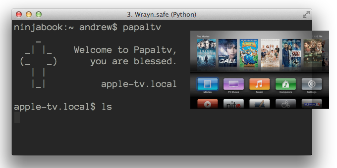
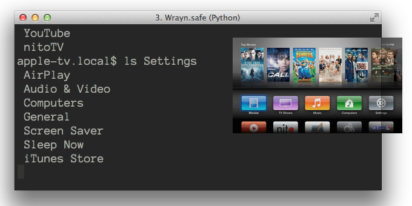
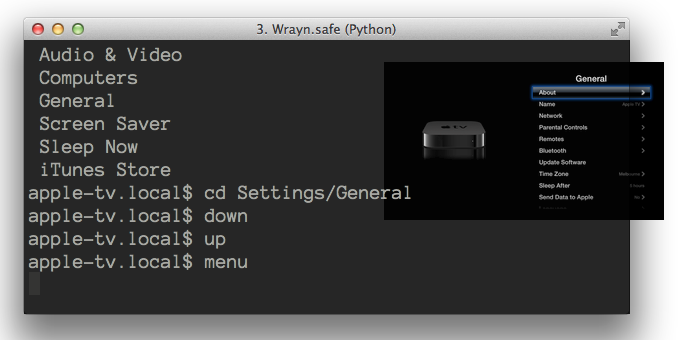
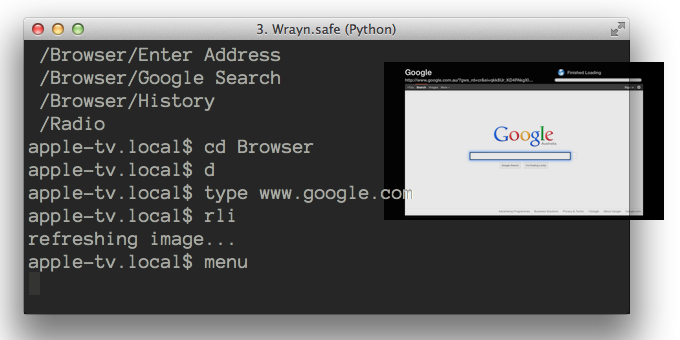
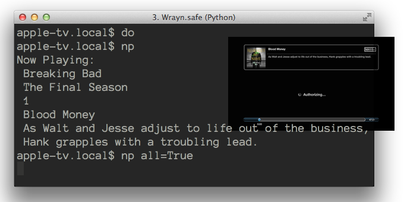

# PapalTv - interactive shell for ATV2+

#### Commmunication via fireCore's Aircontrol protocol, for jailbroken units only (sorry)

See [their page for details](http://support.firecore.com/entries/21375902-3rd-Party-Control-API-AirControl-beta-).
on the requirements to get aircontrol up and running.

----

## Overview

This package provides both an interactive shell and a python
library for communicating with jailbroken Apple TV's.

There's folder list options, navigation, searching, play,
pause, now playing and **omgzr** even more! 

*this started as a joke... what have I done?*

## Sample session

#### Login:
    awesomehost: $ papaltv
        _
      _| |_    Welcome to Papaltv,
     (_   _)      you are blessed.
       | |
       |_|          apple-tv.local    

    apple-tv.local$ ls
     Add Site
     Apple Events
     Browser
     Computers
     Flickr
     Infuse
     MLB.TV

...

#### Navigation:
    apple-tv.local$ cd /Settings/General

#### Menu Control
    apple-tv.local$ down
    apple-tv.local$ up
    apple-tv.local$ menu
    apple-tv.local$ hold_select

#### Shortcut comands  (up and menu shown below)
    apple-tv.local$ u    
    apple-tv.local$ m

#### Chained commands for quick navigation
    apple-tv.local$ mmmmrr

#### Even quicker chaining if you're game
    apple-tv.local$ 24d6ruom,,,ollro

Quite a few commands implemented
    apple-tv.local$ help    

    ======================
    EOF        find           log        
    cd         hold_menu      log_debug  
    down       hold_select    log_warn   
    ff         left           ls         
    menu       playing        quit
    ok         playpause      right
    pause      psoup          rw
    play       q              sel
    select     stop           up
    skip       text        
    skip_back  toggle        
    soup       type        

## Screenshots

## What on earth for???

I'll tell you what for! (*the lolz*)

## No really, what for?
Umm... how about umm .. for scheduling crazy cron jobs?

#### use papaltv to check up on your kids tv

    if test `papaltv --cmd np \
      |grep -o pr0n` == pr0n; then
        echo 'big brother sees you' | /usr/local/bin/sms_gateway `cat ~/kidsnums.txt` 
    fi

#### use papaltv to annoy your wife

    if test `papaltv --cmd np \
      |grep -o "gossip girl"` == "gossip girl"; then
        if test $(( $RANDOM %= 200 )) < 80; then
            papaltv --cmd stop
            sleep 20
            papaltv --cmd cd /Settings/General
            sleep 5
            echo 'hahahahahah'
        fi
    fi

#### use papaltv to please your wife

**NOTE: not actually possible**

    while test `papaltv --cmd np \
       |grep -o "gossip girl"` == "gossip girl"; do
        sleep 5
    done
    ~/speech_synthesis "well wasn't that one a diffy"
    sleep 30
    ~/speech_synthesis "uhuh?, oh yeah I know"
    sleep ((60 * 90))
    ~/speech_synthesis "wow, that was an interesting story about your day. thanks dear."

----

or... just use it when you lose the tiny remote.

### Want more??? Prepared to sell your soul?

Well now.. have I got a deal for you. I've included an example class
which tells papaltv how to find your media collection so that you can
even start shows by name. 

... but... you have to code your own script. I've kept that crazy stuff
out of the main papaltv module, but it's included in the extra - more evil
module evilpope... no, wait: popeville. Yes... Good... Goood.

    ninjabook:extensions andrew$ popeville  

        / \
       |   |
       |___|   Welcome to PopeVille,
                   I am the blessed.
       \/ \/
       O   O          apple-tv.local
        --- 

    apple-tv.local$ ls /mnt/tv/Pure Pwnage/Season 01
     Pure.Pwnage.S01E01.The.Life.Of.A.Pro.Gamer.avi
     Pure.Pwnage.S01E02.Girls.avi
     Pure.Pwnage.S01E03.FPS.Doug.avi
     ...

